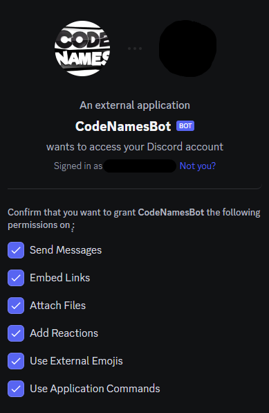

# discord-code-names-bot

<!-- Improved compatibility of back to top link: See: https://github.com/othneildrew/Best-README-Template/pull/73 -->
<a name="readme-top"></a>

<!-- PROJECT LOGO -->
<br />
<div align="center">
  <a href="https://github.com/LucasDarie/discord-code-names-bot">
    
  </a>

  <h3 align="center">Code Names Discord Bot</h3>

  <p align="center">
    An awesome bot to play Code Names on discord
    <br />
    <a href="https://github.com/LucasDarie/discord-code-names-bot"><strong>Invite the bot to your server »</strong></a>
  </p>
</div>


<!-- TABLE OF CONTENTS -->
<details>
  <summary>Table of Contents</summary>
  <ol>
    <li><a href="#about-the-project">About The Project</a></li>
    <li><a href="#invite">Invite the bot</a></li>
    <li>
        <a href="#usage">Usage</a>
        <ul>
            <li><a href="#create-a-game">Create a game</a></li>
            <li><a href="#delete-a-game">Delete a game</a></li>
            <li><a href="#join-a-game">Join a game</a></li>
            <li><a href="#leave-a-game">Leave a game</a></li>
            <li><a href="#start-a-game">Start a game</a></li>
            <li><a href="#display-the-grid">Dsiplay the grid</a></li>
            <li><a href="#suggest-a-hint">Suggest a hint</a></li>
            <li><a href="#guess-a-word">Guess a word</a></li>
            <li><a href="#upload-word-list">Upload word list</a></li>
        </ul>
    </li>
    <li><a href="#roadmap">Roadmap</a></li>
    <!--<li><a href="#contributing">Contributing</a></li>-->
    <li><a href="#contact">Contact</a></li>
    <li><a href="#credit">Credit</a></li>
  </ol>
</details>
</br>


<!-- ABOUT THE PROJECT -->
## About The Project

This bot allowed you to play [Code Names](https://codenames.game) on discord !

You can upload your own word list and start games with up to 4 teams !

Player grid image
[![Player grid empty][player-grid]]()

Spy grid image
[![Spy grid][spy-grid]]()


<p align="right">(<a href="#readme-top">back to top</a>)</p>


<!-- Invite -->

## Invite

Just invite the bot with the following link: [Invite discord bot](https://example.com)

Don't forget to accept the following permissions when inviting the bot :



<p align="right">(<a href="#readme-top">back to top</a>)</p>


<!-- USAGE -->
## Usage

All commmands are available with `buttons` and `pop up window` except the `/create`, `/delete` and `/upload` commands which are only avaible with `slash commands`

[![Test of buttons in game lobby][interactions-loby]]()

All commands are also available with `slash command`
<details>
    <summary>List of available slash commands</summary>
    <ul>
        <li><a href="#create-a-game">/create</a></li>
        <li><a href="#delete-a-game">/delete</a></li>
        <li><a href="#join-a-game">/join</a></li>
        <li><a href="#leave-a-game">/leave</a></li>
        <li><a href="#start-a-game">/start</a></li>
        <li><a href="#display-the-grid">/display</a></li>
        <li><a href="#suggest-a-hint">/suggest</a></li>
        <li><a href="#guess-a-word">/guess</a></li>
        <li><a href="#upload-word-list">/upload</a></li>
    </ul>
</details>

### Create a game

You can create one game per discord channel simultaneously

To create a game you need to use the following command:
```
/create LANGUAGE NB_TEAMS [DEFAULT_WORD_LIST] [SERVER_WORD_LIST]
```
- LANGUAGE: `[English | French]`
- NB_TEAMS: `[1 | 2 | 3 |  4]`
- [DEFAULT_WORD_LIST]: `[True | False]` (default : `True`)
- [SERVER_WORD_LIST]: `[True | False]` (default : `False`)

<p align="right">(<a href="#readme-top">back to top</a>)</p>

### Delete a game
<a name="delete-command"></a>

To delete a game run this command in the channel where the game was created:

```
/delete
```

<p align="right">(<a href="#readme-top">back to top</a>)</p>

### Join a game
<a name="join-command"></a>
To join a game run this command and choose your team:

```
/join TEAM [SPY]
```

- TEAM: `[BLUE | RED | GREEN | YELLOW]`
- SPY: `[True | False]` (be part of the list of potential spies)

(1 team : blue, 2 teams: blue or red 3 teams: blue, red or green...)

<p align="right">(<a href="#readme-top">back to top</a>)</p>

### Leave a game
<a name="leave-command"></a>

To leave a game run this command:

```
/leave
```

<p align="right">(<a href="#readme-top">back to top</a>)</p>

### Start a game
<a name="start-command"></a>

To start a game the `game creator` can run this command:

```
/start
```

<p align="right">(<a href="#readme-top">back to top</a>)</p>

### Display the grid
<a name="display-command"></a>

Each `player of the game` can display the grid by running this command:

```
/display
```
The grid will be display only for the user that ran the command  
If the user is a spy the spy's grid will be displayed, else it will be the "normal" grid

<p align="right">(<a href="#readme-top">back to top</a>)</p>

### Suggest a hint
<a name="suggest-command"></a>

When it's their turn, the spy can run this command to suggest a hint:

```
/suggest HINT NUMBER_OF_TRY
```

- HINT: `a single word, not present in the grid (unless the word is already found)`
- NUMBER_OF_TRY: `a strictly positive number`

(don't forget to read the `rules` to be fair with your teammates and suggest suitable words)

Overview of the suggestion pop up window:

[![Suggestion pop up window][modal-spy]]()

<p align="right">(<a href="#readme-top">back to top</a>)</p>

### Guess a word
<a name="guess-command"></a>

When it's their turn, players can run this command to guess a word:

```
/guess <WORD | CARD_ID>
```

- WORD: `a single word not found, present in the grid`
- CARD_ID: `a number between 1 and "number_of_word", representing a not found word present in the grid`

Overview of the word guesing window:

[![Guessing pop up window][modal-player]]()

<p align="right">(<a href="#readme-top">back to top</a>)</p>

### Skip your turn
<a name="skip-command"></a>

When it's their turn, players can run this command after guessing at least 1 word to skip their turn:

```
/skip
```

<p align="right">(<a href="#readme-top">back to top</a>)</p>

### Upload word list
<a name="upload-command"></a>

You can upload a single list of words per server

```
/upload FILE
```

- FILE: `a .txt file containing all your word`

Conditions for uploading a file:

- MAX 1000 words
- 1 word per line
- MAX 11 characters per word
- NO SPACES in a line
- alphanumeric characters, hyphen (-) and underscore (_) allowed


<p align="right">(<a href="#readme-top">back to top</a>)</p>


<!-- ROADMAP -->
## Roadmap

- [x] Add buttons support
- [x] Add modal Support
    - [x] guess
    - [x] suggest 
    - [ ] create (not possible to put select in modals for know)
- [ ] Multi-language Support
    - [x] English
    - [x] French
    - [ ] German
    - [ ] Spanish
- [ ] create a solo mode

See the [open issues](https://github.com/LucasDarie/discord-code-names-bot/issues) for a full list of proposed features (and known issues).

<p align="right">(<a href="#readme-top">back to top</a>)</p>


<!-- CONTRIBUTING 
## Contributing

Contributions are what make the open source community such an amazing place to learn, inspire, and create. Any contributions you make are **greatly appreciated**.

If you have a suggestion that would make this better, please fork the repo and create a pull request. You can also simply open an issue with the tag "enhancement".
Don't forget to give the project a star! Thanks again!

1. Fork the Project
2. Create your Feature Branch (`git checkout -b feature/AmazingFeature`)
3. Commit your Changes (`git commit -m 'Add some AmazingFeature'`)
4. Push to the Branch (`git push origin feature/AmazingFeature`)
5. Open a Pull Request

<p align="right">(<a href="#readme-top">back to top</a>)</p>
-->


<!-- CONTACT -->
## Contact

Lucas Darie

Project Link: [https://github.com/LucasDarie/discord-code-names-bot](https://github.com/LucasDarie/discord-code-names-bot)

<p align="right">(<a href="#readme-top">back to top</a>)</p>


<!-- CREDIT -->
## Credit

This bot is wirtten in python using interactions.py

* [interactions.py Github page](https://github.com/interactions-py/interactions.py)
* [interactions.py Discord server](https://discord.gg/interactions)

<p align="right">(<a href="#readme-top">back to top</a>)</p>


<!-- MARKDOWN LINKS & IMAGES -->
<!-- https://www.markdownguide.org/basic-syntax/#reference-style-links -->

[Python-url]: https://www.python.org
[Python.org]: https://img.shields.io/badge/python-3670A0?style=for-the-badge&logo=python&logoColor=ffdd54
[player-grid]: images/readme/grid_PLAYER.png
[spy-grid]: images/readme/grid_SPY.png
[interactions-loby]: images/readme/interaction_lobby.gif
[modal-player]: images/readme/modal_PLAYER.png
[modal-spy]: images/readme/modal_SPY.png
[invite-permissions]: images/readme/invite_permission.png